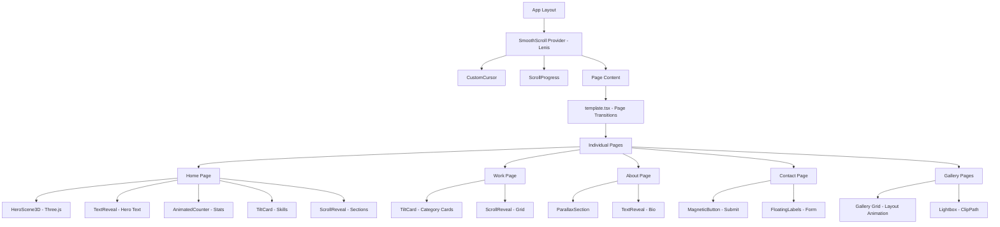

# 🎬 Extraordinary 3D/4D Portfolio — Design & Animation Plan

> **Goal**: Transform this cinematic portfolio into an award-winning, Awwwards-level experience with 3D/4D effects, impressive movements, and a premium light mode — while maintaining performance and accessibility.

---

## Table of Contents

1. [Color System](#1-color-system)
2. [Animation & Effects Library Stack](#2-animation--effects-library-stack)
3. [Global Effects](#3-global-effects)
4. [Page-by-Page Design](#4-page-by-page-design)
5. [Light Mode Overhaul](#5-light-mode-overhaul)
6. [Component Specifications](#6-component-specifications)
7. [Implementation Priority](#7-implementation-priority)
8. [Performance Budget](#8-performance-budget)

---

## 1. Color System

### Design Philosophy

The current gold/obsidian palette is strong for dark mode but the light mode feels flat and generic. The new system introduces **warm ivory** and **rich cream** tones for light mode, paired with a refined accent system that works across both themes.

### CSS Custom Properties

```css
/* ═══════════════════════════════════════════════════════════════
   NEW COLOR SYSTEM — Replace existing :root and [data-theme] blocks
   ═══════════════════════════════════════════════════════════════ */

:root,
[data-theme="dark"] {
  /* ── Backgrounds ── */
  --background: #030303;
  --background-elevated: #0a0a0a;
  --background-subtle: #111111;
  --background-muted: #1a1a1a;

  /* ── Foregrounds ── */
  --foreground: #f0f0f0;
  --foreground-muted: #9ca3af;
  --foreground-subtle: #6b7280;

  /* ── Accent: Gold (Primary) ── */
  --accent: #d4af37;
  --accent-light: #f5d76e;
  --accent-dark: #b5952f;
  --accent-glow: rgba(212, 175, 55, 0.4);
  --accent-subtle: rgba(212, 175, 55, 0.08);
  --accent-border: rgba(212, 175, 55, 0.15);

  /* ── Accent: Electric Blue (Secondary — 3D depth cues) ── */
  --accent-2: #4f9cf7;
  --accent-2-glow: rgba(79, 156, 247, 0.3);
  --accent-2-subtle: rgba(79, 156, 247, 0.06);

  /* ── Accent: Violet (Tertiary — highlights, hovers) ── */
  --accent-3: #a78bfa;
  --accent-3-glow: rgba(167, 139, 250, 0.25);

  /* ── Cards & Surfaces ── */
  --card-bg: rgba(10, 10, 10, 0.6);
  --card-bg-hover: rgba(17, 17, 17, 0.8);
  --card-border: rgba(255, 255, 255, 0.04);
  --card-border-hover: rgba(212, 175, 55, 0.2);
  --card-shadow: 0 25px 80px rgba(0, 0, 0, 0.5);

  /* ── Navigation ── */
  --nav-bg-scrolled: rgba(3, 3, 3, 0.92);
  --nav-bg-top: rgba(0, 0, 0, 0.60);
  --nav-border: rgba(255, 255, 255, 0.06);

  /* ── 3D & Depth ── */
  --depth-shadow-1: 0 4px 6px -1px rgba(0, 0, 0, 0.3);
  --depth-shadow-2: 0 10px 25px -5px rgba(0, 0, 0, 0.4);
  --depth-shadow-3: 0 25px 60px -12px rgba(0, 0, 0, 0.6);
  --depth-shadow-glow: 0 0 60px rgba(212, 175, 55, 0.08);

  /* ── Gradients ── */
  --gradient-hero: linear-gradient(135deg, #030303 0%, #0a0a0a 40%, #080808 70%, #030303 100%);
  --gradient-accent: linear-gradient(135deg, #d4af37 0%, #f5d76e 50%, #d4af37 100%);
  --gradient-mesh: radial-gradient(ellipse 80% 50% at 50% 50%, rgba(212, 175, 55, 0.06) 0%, transparent 70%);

  /* ── Grain & Texture ── */
  --grain-opacity: 0.03;
  --noise-blend: overlay;

  color-scheme: dark;
}

/* ═══════════════════════════════════════════════════════════════
   LIGHT MODE — Premium, Warm, NOT generic white
   ═══════════════════════════════════════════════════════════════ */

[data-theme="light"] {
  /* ── Backgrounds — Warm ivory/cream palette ── */
  --background: #faf8f5;
  --background-elevated: #ffffff;
  --background-subtle: #f3efe9;
  --background-muted: #ebe5dc;

  /* ── Foregrounds ── */
  --foreground: #1a1614;
  --foreground-muted: #5c534a;
  --foreground-subtle: #8a7f74;

  /* ── Accent: Deep Gold (richer for contrast on light) ── */
  --accent: #a67c00;
  --accent-light: #c99a2e;
  --accent-dark: #7a5c00;
  --accent-glow: rgba(166, 124, 0, 0.25);
  --accent-subtle: rgba(166, 124, 0, 0.06);
  --accent-border: rgba(166, 124, 0, 0.2);

  /* ── Accent: Deep Blue (Secondary) ── */
  --accent-2: #2563eb;
  --accent-2-glow: rgba(37, 99, 235, 0.2);
  --accent-2-subtle: rgba(37, 99, 235, 0.05);

  /* ── Accent: Purple (Tertiary) ── */
  --accent-3: #7c3aed;
  --accent-3-glow: rgba(124, 58, 237, 0.15);

  /* ── Cards & Surfaces ── */
  --card-bg: rgba(255, 255, 255, 0.85);
  --card-bg-hover: rgba(255, 255, 255, 0.95);
  --card-border: rgba(26, 22, 20, 0.08);
  --card-border-hover: rgba(166, 124, 0, 0.25);
  --card-shadow: 0 25px 80px rgba(26, 22, 20, 0.08);

  /* ── Navigation ── */
  --nav-bg-scrolled: rgba(250, 248, 245, 0.95);
  --nav-bg-top: rgba(250, 248, 245, 0.7);
  --nav-border: rgba(26, 22, 20, 0.06);

  /* ── 3D & Depth — Warm shadows ── */
  --depth-shadow-1: 0 4px 6px -1px rgba(26, 22, 20, 0.06);
  --depth-shadow-2: 0 10px 25px -5px rgba(26, 22, 20, 0.1);
  --depth-shadow-3: 0 25px 60px -12px rgba(26, 22, 20, 0.15);
  --depth-shadow-glow: 0 0 60px rgba(166, 124, 0, 0.06);

  /* ── Gradients ── */
  --gradient-hero: linear-gradient(135deg, #faf8f5 0%, #f3efe9 40%, #faf8f5 100%);
  --gradient-accent: linear-gradient(135deg, #a67c00 0%, #c99a2e 50%, #a67c00 100%);
  --gradient-mesh: radial-gradient(ellipse 80% 50% at 50% 50%, rgba(166, 124, 0, 0.04) 0%, transparent 70%);

  /* ── Grain & Texture ── */
  --grain-opacity: 0.015;
  --noise-blend: soft-light;

  color-scheme: light;
}
```

### Tailwind Theme Extension (inline @theme)

```css
@theme inline {
  /* Existing colors remain, add new semantic tokens */
  --color-background: var(--background);
  --color-foreground: var(--foreground);
  --color-accent: var(--accent);
  --color-accent-light: var(--accent-light);
  --color-accent-dark: var(--accent-dark);
  --color-accent-2: var(--accent-2);
  --color-accent-3: var(--accent-3);
  --color-surface: var(--card-bg);
  --color-surface-hover: var(--card-bg-hover);
  --color-muted: var(--foreground-muted);
  --color-subtle: var(--foreground-subtle);
}
```

### Contrast Ratios (WCAG AA Compliance)

| Element | Dark Mode | Light Mode | Ratio |
|---------|-----------|------------|-------|
| Body text on bg | #f0f0f0 on #030303 | #1a1614 on #faf8f5 | 18.5:1 / 14.2:1 |
| Muted text on bg | #9ca3af on #030303 | #5c534a on #faf8f5 | 8.1:1 / 5.4:1 |
| Accent on bg | #d4af37 on #030303 | #a67c00 on #faf8f5 | 8.9:1 / 5.1:1 |
| Accent on card | #d4af37 on #0a0a0a | #a67c00 on #ffffff | 8.5:1 / 4.9:1 |

---

## 2. Animation & Effects Library Stack

### Recommended Packages

| Package | Purpose | Size (gzip) | Priority |
|---------|---------|-------------|----------|
| `framer-motion` ✅ | Page transitions, scroll animations, layout animations | ~43kb (already installed) | **P0** |
| `@studio-freight/lenis` | Butter-smooth scrolling | ~5kb | **P1** |
| `gsap` + `ScrollTrigger` | Complex scroll-driven 3D animations, timeline sequences | ~30kb | **P1** |
| `@react-three/fiber` + `@react-three/drei` | 3D scenes, particle systems, floating geometry | ~50kb (tree-shaken) | **P2** |
| `splitting` | Character-by-character text split for reveal animations | ~2kb | **P1** |
| `vanilla-tilt` (or custom) | 3D card tilt on hover | ~3kb (or custom ~1kb) | **P1** |

### NPM Install Command

```bash
npm install @studio-freight/lenis gsap splitting
npm install @react-three/fiber @react-three/drei three
npm install --save-dev @types/three
```

### Architecture Decision: Hybrid Approach

- **Framer Motion**: Page transitions, layout animations, simple scroll reveals, component-level motion
- **GSAP + ScrollTrigger**: Complex scroll-driven sequences, timeline-based animations, text reveals, pinned sections
- **Three.js (R3F)**: Hero background 3D scene (floating geometry, particles), optional per-page 3D elements
- **Lenis**: Global smooth scroll, replaces native scroll behavior
- **Custom hooks**: Magnetic cursor, tilt effects, parallax (reduce dependency on large libraries)

---

## 3. Global Effects

### 3.1 Smooth Scroll (Lenis)

```
Location: src/components/SmoothScroll.tsx (client component, wraps app)
Behavior:
  - Duration: 1.2s
  - Easing: cubic-bezier(0.25, 0, 0.55, 1)
  - Smooth wheel scrolling
  - Touch remains native for mobile performance
  - Integrates with GSAP ScrollTrigger
```

### 3.2 Custom Cursor

```
Location: src/components/CustomCursor.tsx
Behavior:
  - Default: 12px circle, accent color border, follows mouse with 0.15s spring delay
  - Hover (links/buttons): Expands to 48px, fills with accent-subtle, magnetic pull (8px radius)
  - Hover (images/cards): Morphs to "View" text label
  - Hover (external links): Morphs to arrow icon
  - Click: Scale down to 0.8 then spring back
  - Hidden on touch devices (matchMedia: pointer: coarse)
  - Blend mode: difference (for contrast on any background)
```

Magnetic pull algorithm:
```
On mousemove near interactive element (distance < 80px):
  - Calculate vector from element center to cursor
  - Apply lerp(0.2) translation to element toward cursor
  - On mouseleave: spring back with stiffness: 400, damping: 20
```

### 3.3 Page Transitions

```
Location: src/app/[locale]/template.tsx (enhance existing)
Current: Simple opacity + translateY
New: Clip-path wipe + scale + blur combination

Entry animation:
  - clipPath: inset(100% 0 0 0) → inset(0% 0 0 0)
  - scale: 0.98 → 1
  - filter: blur(4px) → blur(0px)
  - Duration: 0.6s
  - Easing: [0.76, 0, 0.24, 1] (custom expo out)

Exit animation:
  - clipPath: inset(0% 0 0 0) → inset(0 0 100% 0)
  - opacity: 1 → 0.6
  - Duration: 0.4s
  - Easing: [0.55, 0, 1, 0.45] (custom expo in)
```

### 3.4 Scroll Progress Indicator

```
Location: src/components/ScrollProgress.tsx (enhance existing ReadingProgress)
Visual:
  - Fixed top, 3px height
  - Gradient fill: accent → accent-2 → accent-3
  - Glow effect: box-shadow 0 0 10px var(--accent-glow)
  - Scale animation on scroll milestones (25%, 50%, 75%, 100%)
  - Subtle pulse at 100%
```

### 3.5 Scroll-Triggered Reveal System

```
Location: src/components/ScrollReveal.tsx
Variants:
  - fadeUp: translateY(60px) + opacity(0) → translateY(0) + opacity(1)
  - fadeLeft: translateX(-60px) + opacity(0) → origin
  - fadeRight: translateX(60px) + opacity(0) → origin
  - scaleIn: scale(0.85) + opacity(0) → scale(1) + opacity(1)
  - rotateIn: rotateX(15deg) + translateY(40px) + opacity(0) → origin
  - splitText: each character staggered 0.02s, translateY(100%) → 0
  - clipReveal: clipPath inset(100% 0 0 0) → inset(0)

Timing:
  - Duration: 0.8s-1.2s depending on variant
  - Easing: [0.16, 1, 0.3, 1] (custom "smooth power4 out")
  - Stagger (children): 0.08s-0.12s
  - Trigger: IntersectionObserver at 0.15 threshold (or GSAP ScrollTrigger start: "top 85%")
  - Once: true (animate once, stay visible)
```

### 3.6 Floating Parallax Elements

```
Location: src/components/FloatingElements.tsx
Elements: Abstract geometric shapes (circles, triangles, lines) at various depths
Behavior:
  - Each element has a parallax factor (0.02 to 0.08)
  - Moves opposite to scroll direction × factor
  - Gentle rotation: rotate(scrollY * 0.02deg)
  - Opacity: 0.03 to 0.08 (very subtle)
  - CSS: will-change: transform; transform: translateZ(0)
  - Disabled at < 768px for performance
```

### 3.7 Grain/Noise Texture

```
Current: SVG filter in body::before (already exists)
Enhancement:
  - Animate grain position subtly: translate every 100ms by random 1-2px
  - Light mode: reduce opacity and use soft-light blend
  - Add option for animated gradient noise (CSS hue-rotate on grain)
```

---

## 4. Page-by-Page Design

### 4.1 HOME PAGE

#### Hero Section — "Cinematic 3D Entrance"

```
┌─────────────────────────────────────────────────────────┐
│  ┌─── 3D Background Scene (Three.js Canvas) ────────┐  │
│  │  • Floating metallic geometry (icosahedron, torus)│  │
│  │  • Particle field (200 particles, gold/white)     │  │
│  │  • Responds to mouse position (subtle rotation)   │  │
│  │  • Ambient light + point light at cursor pos      │  │
│  └──────────────────────────────────────────────────┘  │
│                                                         │
│           [Prologue Badge — fade + scale in]            │
│                                                         │
│       ███████ HERO TEXT ███████                         │
│       (3D perspective transform on scroll)              │
│       (Character-by-character stagger reveal)           │
│       (Subtle text-shadow depth on hover)               │
│                                                         │
│       [Subtitle — typewriter + cursor blink]            │
│                                                         │
│   [CTA Button ─ magnetic + ripple]  [Secondary CTA]    │
│                                                         │
│       ┌─ Stats ─────────────────────────────┐          │
│       │  Counter animation (0 → value)      │          │
│       │  Each stat staggers in with 3D flip │          │
│       └─────────────────────────────────────┘          │
│                                                         │
│              ▼ Scroll indicator (bounce)                │
└─────────────────────────────────────────────────────────┘
```

**3D Background Scene Spec:**
- Framework: `@react-three/fiber` + `@react-three/drei`
- Objects: 3-5 floating metallic shapes (gold material, roughness: 0.3, metalness: 0.9)
- Particles: `<Points>` component, 200 points, size 0.02, color: accent with random opacity
- Camera: perspective, fov: 45, responds to mouse with lerp(0.05)
- Performance: `frameloop="demand"`, `dpr={[1, 1.5]}`, suspended on mobile
- Fallback: Animated gradient mesh (CSS) for mobile/low-end devices

**Hero Text Animation:**
```
- Split into characters using `splitting` library
- Each character: translateY(110%) → translateY(0)
- Stagger: 0.025s per character
- Easing: [0.76, 0, 0.24, 1]
- On scroll (parallax): translateZ(-50px) + scale(0.95) + opacity fade
- 3D perspective: parent has perspective(1000px), text has rotateX(2deg) on scroll
```

**Stats Counter Animation:**
```
- useCountUp hook: start 0, end value, duration 2s, easing easeOut
- Trigger: when in viewport
- Each stat card: translateY(40px) + rotateX(10deg) → origin
- Stagger: 0.15s
- On hover: card lifts (translateY(-4px)) with glow shadow
```

#### Story Chapters — "Immersive Timeline"

```
Enhancement over current:
- GSAP ScrollTrigger pinning: Each chapter pins briefly as it reveals
- 3D card rotation: Cards start at rotateY(8deg) and flatten on scroll into view
- Timeline line: Draws progressively (strokeDashoffset animation) as user scrolls
- Timeline dots: Scale and glow when their chapter is in view
- Parallax layering: Background elements at different scroll speeds
- Text reveals: Sentence-by-sentence clip-path reveal
```

#### Skills Showcase — "3D Card Grid"

```
Enhancement:
- 3D tilt effect on hover (vanilla-tilt or custom):
  - Max tilt: 15deg
  - Perspective: 1000px
  - Scale on hover: 1.02
  - Glare effect: white gradient overlay that moves with tilt angle
  - Transition: transform 0.6s cubic-bezier(0.23, 1, 0.32, 1)
  
- Staggered entrance: scale(0.8) + rotateY(-10deg) → origin
- Stagger: 0.08s per card
- Background glow follows hover position (radial gradient at mouse coords)
```

#### Featured Projects — "Perspective Gallery"

```
Enhancement:
- Grid enters with 3D perspective: each card starts at different rotateY/rotateX
- On hover: card lifts significantly (translateZ(30px)) with expanded shadow
- Image: Ken Burns effect (slow scale 1.0 → 1.08 over 8s, resets on unhover)
- Category tags: slide in from left with spring animation on hover
- Cursor: changes to "View Project" text on hover over cards
```

#### Marquee — "Infinite Scroll with Depth"

```
Enhancement:
- Add perspective(500px) to container
- Words at slightly different translateZ values (-20px to 20px)
- On hover over word: scale(1.2) + color transition + glow
- Speed adjustment: slows on hover, resumes on leave
- Gradient masks on edges (already suggested, ensure implementation)
```

---

### 4.2 WORK/PROJECTS PAGE

#### Category Grid — "3D Morphing Cards"

```
┌───────────────────────────────────────────────────┐
│  Header: Split-text reveal + clip-path underline  │
│                                                    │
│  ┌─────────┐  ┌─────────┐  ┌─────────┐          │
│  │ Category│  │ Category│  │ Category│           │
│  │  Card   │  │  Card   │  │  Card   │           │
│  │ (3D tilt│  │ (3D tilt│  │ (3D tilt│           │
│  │  hover) │  │  hover) │  │  hover) │           │
│  └─────────┘  └─────────┘  └─────────┘          │
│                                                    │
│  Filter animation: cards morph positions          │
│  using Framer Motion layoutId + layout            │
└───────────────────────────────────────────────────┘
```

**Card Effects:**
```
- 3D Tilt: perspective(1200px), rotateX/Y based on mouse position within card
- Hover state:
  - translateZ(20px) via transform-style: preserve-3d
  - Border glow: animated gradient border (conic-gradient rotation)
  - Image parallax: image moves opposite to tilt direction by 10px
  - Overlay gradient shifts to reveal more of the image
  
- Entry animation (on page load):
  - Cards start below viewport with rotateX(12deg) + scale(0.9)
  - Stagger in: 0.1s per card
  - Easing: spring(stiffness: 100, damping: 15)
```

**Category Filter (if added):**
```
- Filter buttons: pill shape, magnetic hover
- On filter: Framer Motion layout animation
  - Cards that stay: animate to new grid position (layout prop)
  - Cards that leave: scale(0.8) + opacity(0) + rotateY(15deg)
  - Cards that enter: scale(0.8) + opacity(0) → scale(1) + opacity(1)
  - Duration: 0.5s, stagger: 0.05s
```

---

### 4.3 ABOUT PAGE

#### "Parallax Storytelling"

```
Layout:
- Full-width sections with parallax layering
- Profile image: floating with subtle 3D rotation on scroll
- Text blocks: reveal line-by-line with clip-path
- Background: layered gradients at different scroll speeds

Profile Image Effect:
- Container: perspective(1500px)
- Image: rotateY(-5deg) + rotateX(3deg) at rest
- On scroll: smoothly transitions rotation values
- Border: animated gradient border (gold → transparent, rotating)
- Shadow: multi-layer for depth:
  - 0 20px 60px rgba(0,0,0,0.3)
  - 0 0 0 1px var(--accent-border)
  - Glow: 0 0 80px var(--accent-subtle)

Text Reveal:
- Each paragraph line: clip-path inset(0 100% 0 0) → inset(0 0% 0 0)
- Triggered by scroll position
- Duration: 0.8s per line, stagger: 0.1s
- Easing: [0.77, 0, 0.175, 1]
```

---

### 4.4 CONTACT PAGE

#### "Interactive Depth Form"

```
Form Fields:
- Floating labels (translateY animation on focus/filled)
- Input focus: border transitions from subtle to accent with glow
- Input background: subtle parallax shift on mousemove
- Ripple effect on focus

3D Submit Button:
- Container: perspective(600px)
- Button at rest: slight rotateX(2deg) for depth illusion
- Hover: rotateX(0deg) + scale(1.02) + shadow expansion
- Active/click: rotateX(4deg) + scale(0.98) (pressed feel)
- Success: morphs to checkmark with scale animation
- Loading: button content fades, spinner appears with rotate

Contact Cards (left side):
- Each card: subtle hover tilt (5deg max)
- Staggered entrance from left
- Icon: rotates 360deg on card hover (0.6s spring)
- Magnetic pull on icon when cursor nearby
```

---

### 4.5 VIDEOS / PHOTOGRAPHY / AUDIO PAGES

#### "Immersive Gallery Experience"

```
Gallery Grid:
- Masonry-style layout with Framer Motion layout animations
- Cards enter with staggered 3D rotation
- Hover: card lifts + image zoom (1.05) + gradient overlay reveals title

Lightbox/Modal:
- Open: clip-path circle expanding from click position
  - circle(0% at clickX clickY) → circle(150% at 50% 50%)
  - Duration: 0.6s, easing: [0.76, 0, 0.24, 1]
- Content: scales from 0.9 → 1 with slight blur clear
- Close: reverse clip-path + fade
- Navigation: slide left/right with spring physics
- Background: backdrop-filter blur(20px) + dark overlay

Video Player (Videos page):
- Thumbnail: Ken Burns slow zoom
- Play button: pulsing glow ring + magnetic cursor
- On play: card expands to inline player with clip-path morph
- Ambient glow behind video matches dominant color

Audio Player (Audio page):
- Waveform visualization (canvas or SVG)
- Play/pause: morph animation between icons
- Progress bar: gradient fill with glow
- Album art: 3D vinyl spin effect on play (rotateY with perspective)
```

---

## 5. Light Mode Overhaul

### Problem Analysis

Current light mode issues:
1. `#f8f8f6` background is too neutral/cold — feels like an afterthought
2. Gold accent (`#d4af37`) is too pale on light backgrounds — poor contrast
3. No unique shadows/depth system for light — just inverted dark mode
4. Cards lack definition — blend into background
5. No warmth or personality

### Solution: Warm Ivory Premium Theme

**Key Principles:**
- Warm undertone in ALL neutrals (ivory, cream, not gray)
- Accent darkened for contrast (deep gold `#a67c00`, passes WCAG AA)
- Shadows are warm (tinted with brown, not pure black)
- Cards have more visible borders + subtle warm shadows
- Grain texture uses `soft-light` blend mode instead of `overlay`
- Glass effects use warm tints

**Specific Light Mode Overrides:**

```css
[data-theme="light"] {
  /* Scrollbar */
  --scrollbar-track: #f3efe9;
  --scrollbar-thumb: #d4cfc7;
  --scrollbar-thumb-hover: var(--accent);

  /* Selection */
  --selection-bg: rgba(166, 124, 0, 0.15);
  --selection-color: #1a1614;

  /* Glass effect (warmer) */
  --glass-bg: rgba(255, 252, 247, 0.7);
  --glass-border: rgba(166, 124, 0, 0.08);
  --glass-blur: 20px;

  /* Text glow (subtle warm) */
  --text-glow: 0 0 20px rgba(166, 124, 0, 0.15);

  /* Hero overlays — lighter, warmer */
  --hero-overlay-1: linear-gradient(to-r, rgba(250,248,245,0.9), rgba(250,248,245,0.3));
  --hero-overlay-2: linear-gradient(to-t, var(--background), transparent);
}
```

**Navigation in Light Mode:**
```
- Background: warm frosted glass (rgba(250, 248, 245, 0.9) + backdrop-blur)
- Border-bottom: warm gold tint instead of white/gray
- Logo: dark text (#1a1614), hover: accent color
- Links: warm dark (#5c534a), active: accent
- CTA button: deep gold bg, dark text
```

**Cards in Light Mode:**
```
- Background: white with warm shadow
- Border: 1px solid rgba(26, 22, 20, 0.06)
- Shadow: 0 4px 24px rgba(26, 22, 20, 0.06), 0 0 0 1px rgba(26, 22, 20, 0.03)
- Hover shadow: 0 12px 40px rgba(166, 124, 0, 0.08)
- Hover border: rgba(166, 124, 0, 0.15)
```

---

## 6. Component Specifications

### 6.1 MagneticButton Component

```
File: src/components/MagneticButton.tsx
Props: children, className, strength?: number (default: 0.3)

Behavior:
- Track mouse position relative to button center
- Apply transform: translate(dx * strength, dy * strength) on mousemove
- On mouseleave: spring back (stiffness: 400, damping: 28, mass: 1)
- Scale: 1.02 on hover
- Ripple on click: radial gradient expanding from click point

Implementation: Framer Motion useMotionValue + useSpring
```

### 6.2 TiltCard Component

```
File: src/components/TiltCard.tsx
Props: children, className, maxTilt?: number (default: 12), perspective?: number (default: 1000), glare?: boolean

Behavior:
- Calculate tilt from mouse position: rotateX = (mouseY - centerY) / height * maxTilt
- Apply perspective on parent, rotateX/Y on card
- Optional glare: linear-gradient overlay positioned at mouse angle
- Spring physics: stiffness 200, damping 20
- Reset on mouseleave with spring
- Disabled on touch devices

CSS:
  transform-style: preserve-3d;
  transition: transform 0.1s linear; (for direct mouse tracking)
  will-change: transform;
```

### 6.3 TextReveal Component

```
File: src/components/TextReveal.tsx
Props: children (string), type: 'chars' | 'words' | 'lines', stagger?: number, className

Behavior:
- Split text into spans using splitting logic
- Each span wrapped with overflow-hidden parent
- Animation: translateY(110%) → translateY(0%)
- Triggered on scroll into view (IntersectionObserver or ScrollTrigger)
- Stagger: chars=0.02s, words=0.05s, lines=0.1s
- Easing: [0.76, 0, 0.24, 1]
```

### 6.4 ParallaxSection Component

```
File: src/components/ParallaxSection.tsx
Props: children, speed?: number (default: 0.5), direction?: 'up' | 'down'

Behavior:
- Track scroll position with useScroll (Framer Motion)
- Apply translateY = scrollProgress * speed * direction
- Use useTransform for smooth mapping
- will-change: transform on the element
```

### 6.5 HeroScene3D Component

```
File: src/components/HeroScene3D.tsx
Framework: @react-three/fiber

Scene contents:
- 3 floating shapes: Icosahedron, TorusKnot, Octahedron
- Material: MeshStandardMaterial, color: accent, metalness: 0.85, roughness: 0.2
- Each shape: slow auto-rotation + sine-wave float
- Mouse influence: shapes drift toward cursor with lerp(0.02)
- Particles: 150 points, BufferGeometry, random positions in sphere
- Lighting: ambientLight(0.4) + pointLight at cursor(1.0, gold)
- Camera: fov 50, position [0, 0, 6]

Performance:
- frameloop="demand" (only render when scene changes)
- dpr clamp: [1, 1.5]
- Suspense fallback: gradient mesh (CSS animation)
- Lazy load: dynamic import with next/dynamic
- Hidden below 768px width (show CSS fallback instead)
```

### 6.6 AnimatedCounter Component

```
File: src/components/AnimatedCounter.tsx
Props: end: number, duration?: number (default: 2000), prefix?: string, suffix?: string

Behavior:
- Start at 0, animate to end value
- Easing: easeOutExpo
- Trigger: when in viewport (useInView)
- Format: locale-aware number formatting
- Optional: add subtle scale bounce at completion
```

---

## 7. Implementation Priority

### Phase 1: Foundation (Critical Path)

```
[ ] 1.1 Install new dependencies (lenis, gsap, splitting)
[ ] 1.2 Update globals.css with new color system (both themes)
[ ] 1.3 Implement Lenis smooth scroll wrapper
[ ] 1.4 Create ScrollReveal component (replaces manual animate-fade-in-up classes)
[ ] 1.5 Enhance page transition in template.tsx (clip-path animation)
[ ] 1.6 Fix light mode: update all hardcoded colors to use CSS variables
[ ] 1.7 Update Header component for light mode compatibility
[ ] 1.8 Update scrollbar, selection, focus styles for light mode
```

### Phase 2: Core Effects

```
[ ] 2.1 Create MagneticButton component
[ ] 2.2 Create TiltCard component  
[ ] 2.3 Create TextReveal component (character/word/line splitting)
[ ] 2.4 Create AnimatedCounter component
[ ] 2.5 Create CustomCursor component
[ ] 2.6 Enhance ScrollProgress with gradient + glow
[ ] 2.7 Add FloatingElements parallax decorations
```

### Phase 3: Page Enhancements

```
[ ] 3.1 HOME: Implement 3D hero background (Three.js or fallback)
[ ] 3.2 HOME: Hero text split animation + parallax on scroll
[ ] 3.3 HOME: Stats counter animation
[ ] 3.4 HOME: Story chapters with ScrollTrigger pinning
[ ] 3.5 HOME: Skills grid with TiltCard
[ ] 3.6 HOME: Featured projects with 3D hover
[ ] 3.7 HOME: Marquee with depth + hover slow
[ ] 3.8 WORK: Category cards with 3D tilt + stagger entrance
[ ] 3.9 ABOUT: Parallax layers + image 3D rotation + text reveals
[ ] 3.10 CONTACT: Form interactions (floating labels, 3D button, focus effects)
[ ] 3.11 GALLERY PAGES: Staggered grid entrance + lightbox with clip-path
```

### Phase 4: Polish & Optimization

```
[ ] 4.1 Performance audit: ensure LCP < 2.5s, FID < 100ms
[ ] 4.2 Reduce motion: respect prefers-reduced-motion throughout
[ ] 4.3 Mobile optimization: disable heavy effects < 768px
[ ] 4.4 Test both themes end-to-end
[ ] 4.5 Add loading states / skeleton screens with shimmer
[ ] 4.6 Cross-browser testing (Safari, Firefox, Chrome)
```

---

## 8. Performance Budget

### Targets

| Metric | Target | Strategy |
|--------|--------|----------|
| LCP | < 2.5s | Lazy-load Three.js scene, prioritize above-fold content |
| FID | < 100ms | Keep main thread free, defer non-critical animations |
| CLS | < 0.1 | Fixed dimensions on all media, no layout shifts from animations |
| Total JS (gzip) | < 200kb added | Tree-shake Three.js, code-split GSAP per page |
| FPS during scroll | 60fps | Use transform/opacity only, will-change sparingly, GPU layers |

### Optimization Strategies

1. **Code splitting**: Three.js scene loaded via `next/dynamic` with `ssr: false`
2. **Intersection Observer**: Only initialize animations when elements are near viewport
3. **GPU compositing**: All animations use `transform` and `opacity` only (no layout/paint triggers)
4. **Mobile fallback**: Replace Three.js with CSS gradient animation on mobile
5. **will-change management**: Apply only during animation, remove after completion
6. **Lenis**: Disable on mobile (native scroll is already smooth on iOS/Android)
7. **Image optimization**: Continue using Next.js Image with proper sizes/quality
8. **Prefers-reduced-motion**: Disable ALL custom animations, use instant transitions

---

## Architecture Diagram



---

## Summary of Key Decisions

| Decision | Choice | Rationale |
|----------|--------|-----------|
| Smooth scroll | Lenis | Lightweight, integrates with GSAP, butter-smooth |
| Primary animation | Framer Motion + GSAP | FM already installed, GSAP for complex scroll sequences |
| 3D background | React Three Fiber | Declarative, fits React model, tree-shakeable |
| Card tilt | Custom hook | Avoids dependency, tiny footprint, full control |
| Text splitting | Splitting.js | 2kb, framework-agnostic, proven reliability |
| Color approach | CSS custom properties | Already in use, theme-switch without re-render |
| Light mode | Warm ivory palette | Premium feel, strong contrast, not generic |
| Mobile strategy | Progressive degradation | Full effects desktop, simplified mobile, native touch scroll |
